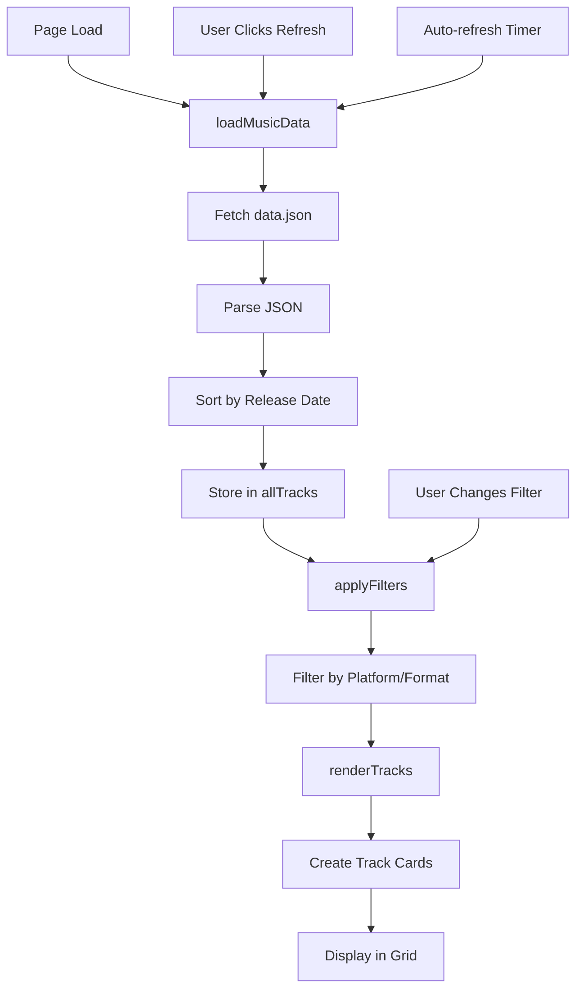
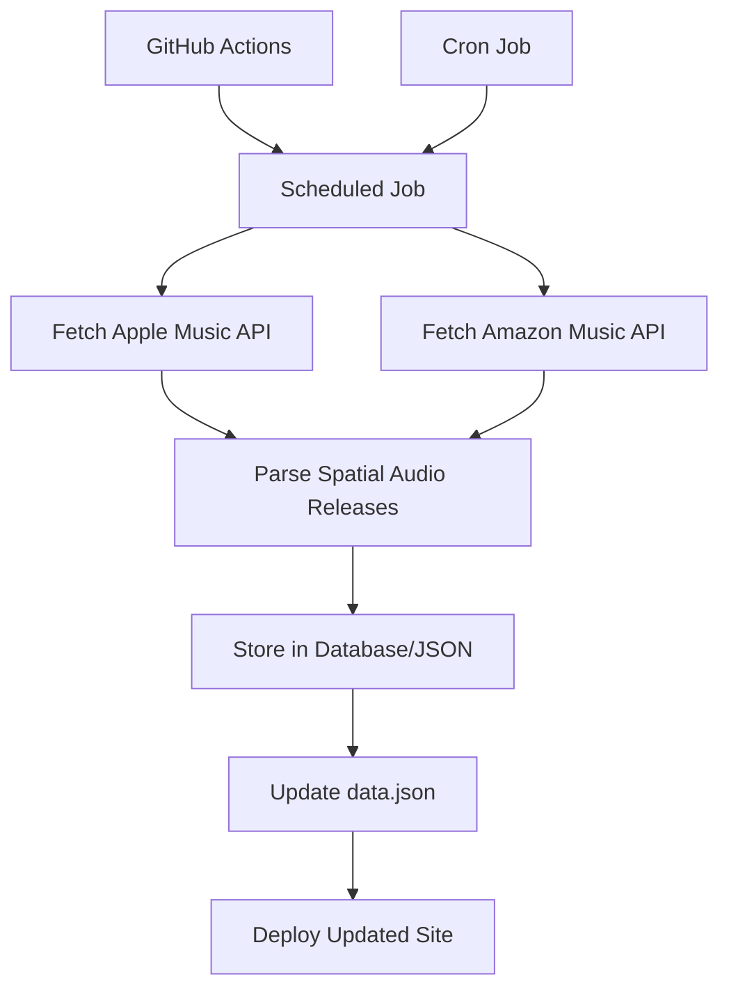

# SpatialSelects.com - Agent Instructions

## Project Overview

**SpatialSelects.com** is a minimalist website that tracks and displays the latest music releases available in immersive spatial audio formats (Dolby Atmos, 360 Reality Audio) on Apple Music and Amazon Music. The site serves as an informational resource and review platform for spatial audio enthusiasts.

### Purpose
- Inform users about new spatial audio releases
- Provide reviews and technical details about spatial audio mixes
- Enable discovery of immersive music across platforms
- Track release dates and format availability

### Target Audience
- Audiophiles interested in spatial audio
- Music enthusiasts seeking immersive listening experiences
- Users deciding between Apple Music and Amazon Music for spatial audio content

### Key Features
- Automated backend discovery (every 48 hours via scheduler)
- Platform filtering (Apple Music, Amazon Music)
- Format filtering (Dolby Atmos, 360 Reality Audio)
- New release badges (last 30 days)
- Responsive, minimalist design
- Manual refresh capability
- REST API for programmatic access

## Architecture

### Technology Stack
- **Frontend**: Vanilla JavaScript (ES6+), HTML5, CSS3
- **Backend**: Python FastAPI with SQLAlchemy ORM
- **Data Storage**: SQLite (development) or PostgreSQL (production), with `data.json` fallback
- **Scheduler**: APScheduler for background jobs (runs every 48 hours)
- **API Integration**: Apple Music API for automatic track discovery
- **Build Tools**: None (pure static site)
- **Development Server**: `http-server` (via npm) for frontend, `uvicorn` for backend
- **Deployment**: Static hosting for frontend (GitHub Pages, Netlify, Vercel), backend on Render/VPS

### File Structure
```
spatial-selecta/
├── index.html              # Main HTML structure and layout
├── styles.css              # All styling, responsive design, CSS variables
├── app.js                   # Frontend application logic, data handling, rendering
├── data.json                # Music releases database (JSON array, fallback)
├── package.json             # Frontend project metadata and dependencies
├── requirements.txt         # Backend Python dependencies
├── backend/
│   ├── main.py              # FastAPI application and endpoints
│   ├── models.py            # SQLAlchemy database models
│   ├── schemas.py           # Pydantic request/response schemas
│   ├── database.py          # Database configuration and session management
│   ├── scheduler.py         # Background job scheduler (APScheduler)
│   └── apple_music_client.py # Apple Music API client
├── README.md                # User-facing documentation
├── SETUP.md                 # Setup guide
├── DEPLOYMENT.md            # Deployment guide
└── agents.md                # This file - AI agent instructions
```

### Data Flow



### Application State

The app maintains the following global state:

- `allTracks`: Array of all loaded tracks from `data.json`
- `filteredTracks`: Array of tracks matching current filter criteria
- `currentFilters`: Object containing active filter selections
  - `platform`: 'all' | 'Apple Music' | 'Amazon Music'
  - `format`: 'all' | 'Dolby Atmos' | '360 Reality Audio'

## Code Organization

### `index.html` Structure

**Header Section** (`<header>`):
- Site title: "SpatialSelects.com"
- Tagline: "Latest releases in spatial audio formats"
- Last updated timestamp (dynamically updated)

**Filters Section** (`.filters`):
- Platform dropdown (`#platformFilter`)
- Format dropdown (`#formatFilter`)
- Refresh button (`#refreshButton`)

**Main Content** (`<main>`):
- Music grid container (`#musicGrid`) - dynamically populated
- Empty state message (`#emptyState`) - shown when no matches

**Footer** (`<footer>`):
- Copyright and project description

### `app.js` Function Reference

#### Core Functions

**`loadMusicData()`** (lines 18-32)
- **Purpose**: Fetches and loads music data from `data.json`
- **Returns**: Promise (resolves when data is loaded)
- **Side Effects**: Updates `allTracks` and `filteredTracks` arrays
- **Error Handling**: Sets arrays to empty on failure, logs error to console
- **Sorting**: Sorts tracks by release date (newest first)

**`setupEventListeners()`** (lines 35-63)
- **Purpose**: Attaches event handlers to filter controls and refresh button
- **Events**:
  - Platform filter change → updates `currentFilters.platform` → calls `applyFilters()`
  - Format filter change → updates `currentFilters.format` → calls `applyFilters()`
  - Refresh button click → reloads data → updates UI → resets button state

**`applyFilters()`** (lines 66-74)
- **Purpose**: Filters `allTracks` based on current filter criteria
- **Logic**: 
  - Platform match: `currentFilters.platform === 'all'` OR `track.platform === currentFilters.platform`
  - Format match: `currentFilters.format === 'all'` OR `track.format === currentFilters.format`
- **Side Effects**: Updates `filteredTracks`, calls `renderTracks()`

**`renderTracks()`** (lines 77-91)
- **Purpose**: Renders filtered tracks to the DOM
- **Logic**: 
  - If no tracks: hides grid, shows empty state
  - If tracks exist: shows grid, hides empty state, populates grid with track cards
- **DOM Manipulation**: Sets `innerHTML` of `#musicGrid`

**`createTrackCard(track)`** (lines 94-112)
- **Purpose**: Generates HTML string for a single track card
- **Parameters**: `track` - track object from data
- **Returns**: HTML string
- **Features**:
  - Format badge (Dolby Atmos/360 Reality Audio)
  - Track title with optional "New" badge
  - Artist name
  - Album name
  - Footer with platform badge and release date
- **Security**: Uses `escapeHtml()` to prevent XSS

#### Utility Functions

**`isNewRelease(dateString)`** (lines 115-121)
- **Purpose**: Determines if a release is within the last 30 days
- **Parameters**: `dateString` - ISO date string (YYYY-MM-DD)
- **Returns**: Boolean
- **Logic**: Calculates days difference, returns true if 0-30 days

**`formatDate(dateString)`** (lines 124-128)
- **Purpose**: Formats ISO date to human-readable string
- **Parameters**: `dateString` - ISO date string
- **Returns**: Formatted string (e.g., "Dec 23, 2025")
- **Format**: "Month Day, Year" (e.g., "Dec 23, 2025")

**`updateLastUpdated()`** (lines 131-143)
- **Purpose**: Updates the "Last updated" timestamp in header
- **Side Effects**: Updates `#lastUpdated` element text content
- **Format**: "Month Day, Year, Hour:Minute AM/PM"

**`escapeHtml(text)`** (lines 146-150)
- **Purpose**: Escapes HTML special characters to prevent XSS attacks
- **Parameters**: `text` - string to escape
- **Returns**: Escaped HTML string
- **Method**: Uses DOM text node to safely escape

**`scheduleWeeklyRefresh()`** (lines 153-179)
- **Purpose**: Schedules automatic data refresh every Friday at 3 PM ET
- **Implementation**: Uses `setInterval` to check every minute
- **Logic**: 
  - Converts current time to ET timezone
  - Checks if it's Friday (day 5) and 3 PM (hour 15)
  - If match, reloads data and updates UI
- **Note**: This is inefficient and only works when page is open. Should be moved to server-side cron job.

### `styles.css` Organization

**CSS Variables** (`:root`, lines 7-18):
- Color scheme: Black/white/gray palette
- Typography: Helvetica Neue font stack
- Spacing: Consistent padding/margin values

**Layout Sections**:
- Header (lines 36-62): Site branding and metadata
- Filters (lines 65-131): Filter controls styling
- Music Grid (lines 134-226): Card-based grid layout
- Empty State (lines 240-251): No results messaging
- Footer (lines 254-266): Site footer

**Responsive Breakpoints**:
- `@media (max-width: 768px)`: Tablet - single column grid, stacked filters
- `@media (max-width: 480px)`: Mobile - adjusted padding

### Data Structure

#### Track Object Schema

```typescript
interface Track {
  id: number;                    // Unique identifier
  title: string;                 // Song title
  artist: string;                // Artist name
  album: string;                 // Album name
  format: "Dolby Atmos" | "360 Reality Audio";  // Audio format
  platform: "Apple Music" | "Amazon Music";     // Platform
  releaseDate: string;           // ISO date (YYYY-MM-DD)
  albumArt: string;             // Emoji placeholder (currently unused)
}
```

#### Example Track

```json
{
  "id": 1,
  "title": "Blinding Lights",
  "artist": "The Weeknd",
  "album": "After Hours",
  "format": "Dolby Atmos",
  "platform": "Apple Music",
  "releaseDate": "2025-12-20",
  "albumArt": "🌃"
}
```

## Development Guidelines

### Code Style

**JavaScript**:
- Use ES6+ features (arrow functions, const/let, template literals)
- Use descriptive function and variable names
- Keep functions focused on single responsibility
- Comment complex logic, especially timezone calculations
- Use `escapeHtml()` for all user-generated content

**HTML**:
- Semantic HTML5 elements (`<header>`, `<main>`, `<section>`, `<footer>`)
- Use descriptive IDs and classes (kebab-case)
- Include ARIA labels for accessibility (to be added)

**CSS**:
- Use CSS variables for theming
- Follow BEM-like naming for components (`.music-card`, `.track-title`)
- Mobile-first responsive design
- Minimalist aesthetic - avoid unnecessary styling

### Adding New Tracks

To add a new track to `data.json`:

1. **Get Track Information**:
   - Title, artist, album name
   - Release date (ISO format: YYYY-MM-DD)
   - Platform (Apple Music or Amazon Music)
   - Format (Dolby Atmos or 360 Reality Audio)

2. **Create Track Object**:
```json
{
  "id": <next available number>,
  "title": "Song Title",
  "artist": "Artist Name",
  "album": "Album Name",
  "format": "Dolby Atmos",
  "platform": "Apple Music",
  "releaseDate": "2025-12-25",
  "albumArt": "🎵"
}
```

3. **Add to Array**: Append to the array in `data.json`
4. **Verify**: Check that JSON is valid (no trailing commas, proper quotes)

### Modifying Filters

**Adding a New Filter Option**:

1. **Update HTML** (`index.html`):
   - Add new `<option>` to the appropriate `<select>` element

2. **Update JavaScript** (`app.js`):
   - Add filter property to `currentFilters` object initialization
   - Update `applyFilters()` to include new filter logic
   - Add event listener in `setupEventListeners()`

3. **Example - Adding Genre Filter**:
```javascript
// In currentFilters initialization
currentFilters = {
    platform: 'all',
    format: 'all',
    genre: 'all'  // New filter
};

// In applyFilters()
const genreMatch = currentFilters.genre === 'all' || track.genre === currentFilters.genre;
return platformMatch && formatMatch && genreMatch;
```

### Updating Styling

**Color Scheme**:
- Modify CSS variables in `:root` selector
- Variables cascade throughout the site
- Maintain contrast ratios for accessibility

**Layout Changes**:
- Grid layout: Modify `grid-template-columns` in `.music-grid`
- Card styling: Update `.music-card` and child elements
- Responsive breakpoints: Adjust `@media` queries

**Adding New UI Elements**:
1. Add HTML structure in `index.html`
2. Style in `styles.css` following existing patterns
3. Add JavaScript logic in `app.js` if interactive

### Testing Approach

**Manual Testing Checklist**:
- [ ] Page loads and displays tracks
- [ ] Filters work correctly (platform and format)
- [ ] Refresh button reloads data
- [ ] "New" badge appears for recent releases (last 30 days)
- [ ] Responsive design works on mobile/tablet
- [ ] Empty state shows when filters return no results
- [ ] Date formatting displays correctly
- [ ] Last updated timestamp updates on refresh

**Browser Compatibility**:
- Test in Chrome, Firefox, Safari, Edge
- Verify ES6 features are supported (or add polyfills)
- Check CSS Grid support

**Data Validation**:
- Verify `data.json` is valid JSON
- Check all required fields are present
- Ensure dates are valid ISO format
- Verify no duplicate IDs

## Common Tasks

### Task: Add a New Track

1. Open `data.json`
2. Find the highest `id` value
3. Create new track object with `id: <highest + 1>`
4. Add to array (maintain JSON syntax)
5. Save file
6. Test by refreshing the page

### Task: Change Filter Options

1. Edit `<select>` element in `index.html`
2. Add/remove `<option>` elements
3. Update filter logic in `applyFilters()` if needed
4. Test filter functionality

### Task: Modify Card Display

1. Edit `createTrackCard()` function in `app.js`
2. Modify HTML template string
3. Update corresponding CSS in `styles.css`
4. Test rendering

### Task: Update Auto-refresh Schedule

1. Edit `scheduleWeeklyRefresh()` in `app.js`
2. Modify day/hour checks (currently Friday 3 PM ET)
3. Update timezone offset if needed
4. Test timing logic

### Task: Add New Badge/Category

1. Add field to track data structure in `data.json`
2. Update `createTrackCard()` to display badge
3. Add CSS styling for badge
4. Update filter logic if filterable

## API Integration Guide (Future)

### Apple Music API

**Resources**:
- Apple Music API Documentation: https://developer.apple.com/documentation/applemusicapi
- Requires Apple Developer account
- Uses MusicKit JS for web integration

**Key Endpoints**:
- Search: `/v1/catalog/{storefront}/search`
- Get Album: `/v1/catalog/{storefront}/albums/{id}`
- Check Spatial Audio: Look for `contentRating` or `attributes` fields

**Implementation Steps**:
1. Register for Apple Developer account
2. Create MusicKit identifier
3. Implement OAuth flow
4. Query catalog for spatial audio releases
5. Parse response and update `data.json` or database

### Amazon Music API

**Resources**:
- Amazon Music API (if available)
- Amazon Product Advertising API (limited music data)
- May require scraping or manual curation

**Challenges**:
- Limited public API access
- May need to use web scraping (check ToS)
- Consider using third-party services

### Recommended Architecture for API Integration



**Implementation Options**:
1. **Serverless Function** (Netlify Functions, Vercel Functions)
   - Run weekly cron job
   - Fetch from APIs
   - Update `data.json` via Git commit
   
2. **GitHub Actions**
   - Scheduled workflow (cron syntax)
   - Run Node.js/Python script
   - Commit updated `data.json`
   
3. **Backend Service** (Node.js/Python)
   - Express/FastAPI server
   - Database (PostgreSQL, MongoDB)
   - REST API endpoint for frontend
   - Scheduled jobs for data collection

## Troubleshooting

### Issue: Tracks Not Displaying

**Symptoms**: Empty grid, no error messages

**Possible Causes**:
1. `data.json` is invalid JSON (check syntax)
2. Fetch failed (check network tab, CORS issues)
3. Filter criteria too restrictive
4. JavaScript error (check console)

**Solutions**:
- Validate JSON syntax (use JSONLint)
- Check browser console for errors
- Verify `data.json` path is correct
- Test with `currentFilters` set to 'all'

### Issue: Filters Not Working

**Symptoms**: Changing filter doesn't update display

**Possible Causes**:
1. Event listeners not attached
2. Filter logic incorrect
3. Data structure mismatch

**Solutions**:
- Check `setupEventListeners()` is called
- Verify `applyFilters()` logic
- Ensure track objects have correct `platform`/`format` values
- Check browser console for errors

### Issue: Auto-refresh Not Working

**Symptoms**: Data doesn't refresh on Friday 3 PM ET

**Possible Causes**:
1. Page not open at refresh time
2. Timezone calculation incorrect
3. Browser tab inactive (throttled timers)

**Solutions**:
- Current implementation only works when page is open
- Move to server-side cron job for reliability
- Consider using Web Workers for background tasks
- Test timezone conversion logic

### Issue: Dates Displaying Incorrectly

**Symptoms**: Wrong date format or timezone

**Possible Causes**:
1. Invalid date string format
2. Browser locale settings
3. Date parsing error

**Solutions**:
- Ensure dates are ISO format (YYYY-MM-DD)
- Check `formatDate()` function
- Verify browser date parsing
- Test with different date strings

### Issue: Styling Broken on Mobile

**Symptoms**: Layout issues on small screens

**Possible Causes**:
1. Missing responsive CSS
2. Viewport meta tag missing
3. CSS Grid not supported

**Solutions**:
- Check `@media` queries in `styles.css`
- Verify viewport meta tag in `<head>`
- Test CSS Grid browser support
- Use Flexbox fallback if needed

## Future Enhancements

### High Priority
1. **Review/Information Content**: Add detail pages/modals with spatial audio mix reviews
2. **Album Art Display**: Render actual album artwork (not just emojis)
3. **Deep Links**: Make cards clickable links to Apple Music/Amazon Music
4. **Search Functionality**: Add search by artist, title, album
5. **Sort Options**: Sort by date, artist, title

### Medium Priority
1. **Genre Filtering**: Add genre field and filter
2. **Pagination**: Handle large datasets efficiently
3. **Favorites**: LocalStorage-based favorites system
4. **Share Functionality**: Share tracks or filtered views
5. **Loading States**: Show loading indicators during data fetch

### Technical Improvements
1. **Error Handling**: Better error messages and recovery
2. **Accessibility**: ARIA labels, keyboard navigation, focus states
3. **Performance**: Lazy loading, virtual scrolling
4. **SEO**: Meta tags, structured data (JSON-LD)
5. **Analytics**: Track user interactions and popular tracks

## Notes for AI Agents

### When Making Changes

1. **Always validate JSON** after editing `data.json`
2. **Test filters** after modifying filter logic
3. **Check responsive design** after CSS changes
4. **Verify XSS protection** when adding user input handling
5. **Maintain minimalist aesthetic** - avoid over-styling

### Code Patterns to Follow

- Use template literals for HTML generation
- Escape all user-generated content with `escapeHtml()`
- Keep functions small and focused
- Use descriptive variable names
- Comment timezone/date logic

### What NOT to Do

- Don't remove `escapeHtml()` calls (security risk)
- Don't break the filter logic
- Don't add unnecessary dependencies
- Don't over-complicate the architecture
- Don't break responsive design

### Questions to Ask Before Major Changes

1. Does this maintain the minimalist design?
2. Will this work on mobile devices?
3. Is the data structure scalable?
4. Does this require new dependencies?
5. How will this affect performance?

---

**Last Updated**: 2025-01-27
**Version**: 1.0.0

